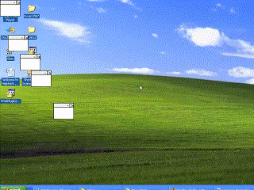

# Windows XP simulator
This program is a processing python mode sketch that pokes fun at Windows XP.  It is not intended to be a serious program but mainly used to demonstrate 

## Features
- Click mouse to BSOD
- move mouse to drag frozen window around screen

## For example:

